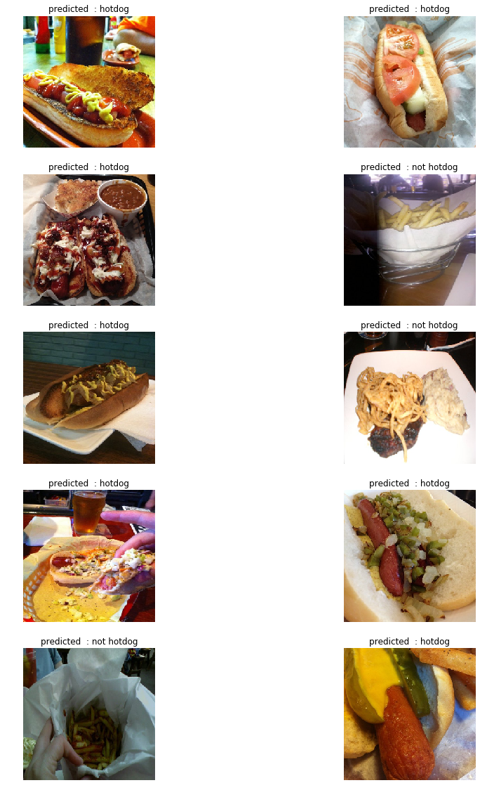

# Hotdog or Not detector
### As I have explained before, in this notebook I want to implement an application to classify images based on "hotdog or not"
#### This detection will be implement based on deep learning approach and I will use Tensorflow for implementing DNN and CNN


```python
import random
import numpy as np
import pandas as pd
import seaborn as sns
from matplotlib import pyplot as plt

import tensorflow as tf
from tensorflow import keras
from tensorflow.keras.preprocessing.image import ImageDataGenerator

print("setup is ready")
```

    setup is ready


If you take a look at images, you will notice that images have different shapes and sizes.
<p>
    So we need some preprocessing on images. By using Tensorflow this preprocessing becomes so easy!
</p>
<p>
    For start we reshape all images to have final (300, 300) shape
</p>


```python
train_datagen = ImageDataGenerator(rescale=1./255)

train_generator = train_datagen.flow_from_directory(
    "../input/hotdog-not/hot-dog-not-hot-dog/",
    target_size=(300, 300),
    batch_size=128,
    class_mode="binary"
)
```

    Found 998 images belonging to 2 classes.


```python
print("final shape of images : ", train_generator.image_shape)
```

    final shape of images :  (300, 300, 3)


So lets see some images randomly!


```python
images, labels = next(train_generator)
plt.figure(figsize=(10,10))
for n in range(25):
    x = random.randrange(128)  
    ax = plt.subplot(5,5,n+1)
    plt.imshow(images[x])
    plt.title(labels[x])
    plt.axis('off')
```


```python
# so zero means hotdog and one means not hotdog
class_names = ["hotdog", 'not hotdog']
```


```python
images, labels = next(train_generator)
plt.figure(figsize=(10,15))
for n in range(25):
    x = random.randrange(128)  
    ax = plt.subplot(5,5,n+1)
    plt.imshow(images[x])
    plt.title(class_names[int(labels[x])])
    plt.axis('off')
```


And lets plot a histogram based on types


```python
sns.distplot(labels, kde=False, bins=20)
```


    <matplotlib.axes._subplots.AxesSubplot at 0x7f22c1f4fef0>


Every thing is ready but we have not buld our model yet!
<p>
    So we use DNN and CNN for build our neural network
</p>


```python
model = tf.keras.models.Sequential([
    tf.keras.layers.Conv2D(16, (3,3), activation='relu', input_shape=(300, 300, 3)),
    tf.keras.layers.MaxPooling2D(2, 2),
    tf.keras.layers.Conv2D(32, (3,3), activation='relu'),
    tf.keras.layers.MaxPooling2D(2,2),
    tf.keras.layers.Conv2D(64, (3,3), activation='relu'),
    tf.keras.layers.MaxPooling2D(2,2),
    tf.keras.layers.Conv2D(64, (3,3), activation='relu'),
    tf.keras.layers.MaxPooling2D(2,2),
    tf.keras.layers.Conv2D(64, (3,3), activation='relu'),
    tf.keras.layers.MaxPooling2D(2,2),
    tf.keras.layers.Flatten(),
    tf.keras.layers.Dense(512, activation='relu'),
    tf.keras.layers.Dense(1, activation='sigmoid')
])

print('MODEL CREATED')
```

    MODEL CREATED


```python
model.summary()
```

    Model: "sequential"
    _________________________________________________________________
    Layer (type)                 Output Shape              Param #   
    =================================================================
    conv2d (Conv2D)              (None, 298, 298, 16)      448       
    _________________________________________________________________
    max_pooling2d (MaxPooling2D) (None, 149, 149, 16)      0         
    _________________________________________________________________
    conv2d_1 (Conv2D)            (None, 147, 147, 32)      4640      
    _________________________________________________________________
    max_pooling2d_1 (MaxPooling2 (None, 73, 73, 32)        0         
    _________________________________________________________________
    conv2d_2 (Conv2D)            (None, 71, 71, 64)        18496     
    _________________________________________________________________
    max_pooling2d_2 (MaxPooling2 (None, 35, 35, 64)        0         
    _________________________________________________________________
    conv2d_3 (Conv2D)            (None, 33, 33, 64)        36928     
    _________________________________________________________________
    max_pooling2d_3 (MaxPooling2 (None, 16, 16, 64)        0         
    _________________________________________________________________
    conv2d_4 (Conv2D)            (None, 14, 14, 64)        36928     
    _________________________________________________________________
    max_pooling2d_4 (MaxPooling2 (None, 7, 7, 64)          0         
    _________________________________________________________________
    flatten (Flatten)            (None, 3136)              0         
    _________________________________________________________________
    dense (Dense)                (None, 512)               1606144   
    _________________________________________________________________
    dense_1 (Dense)              (None, 1)                 513       
    =================================================================
    Total params: 1,704,097
    Trainable params: 1,704,097
    Non-trainable params: 0
    _________________________________________________________________


Now let's compile our model!


```python
from tensorflow.keras.optimizers import RMSprop

model.compile(loss='binary_crossentropy',
              optimizer=RMSprop(lr=0.001),
              metrics=['acc'])

print("Model successfully compiled")
```

    Model successfully compiled


Every thing is ready and we just have to fit our dataset to thid model


```python
history = model.fit_generator(
      train_generator,
      steps_per_epoch=8,  
      epochs=30,
      verbose=1)
```

    Train for 8 steps
    Epoch 1/30
    8/8 [==============================] - 13s 2s/step - loss: 1.0842 - acc: 0.4970
    Epoch 2/30
    8/8 [==============================] - 6s 773ms/step - loss: 0.6900 - acc: 0.5391
    Epoch 3/30
    8/8 [==============================] - 6s 809ms/step - loss: 0.7286 - acc: 0.5421
    Epoch 4/30
    8/8 [==============================] - 7s 818ms/step - loss: 0.6968 - acc: 0.5892
    Epoch 5/30
    8/8 [==============================] - 6s 759ms/step - loss: 0.6794 - acc: 0.5872
    Epoch 6/30
    8/8 [==============================] - 6s 790ms/step - loss: 0.7118 - acc: 0.5531
    Epoch 7/30
    8/8 [==============================] - 6s 770ms/step - loss: 0.6789 - acc: 0.6012
    Epoch 8/30
    8/8 [==============================] - 6s 768ms/step - loss: 0.6829 - acc: 0.5711
    Epoch 9/30
    8/8 [==============================] - 6s 763ms/step - loss: 0.6656 - acc: 0.6212
    Epoch 10/30
    8/8 [==============================] - 6s 751ms/step - loss: 0.6619 - acc: 0.6232
    Epoch 11/30
    8/8 [==============================] - 6s 771ms/step - loss: 0.6782 - acc: 0.5952
    Epoch 12/30
    8/8 [==============================] - 6s 768ms/step - loss: 0.6758 - acc: 0.6132
    Epoch 13/30
    8/8 [==============================] - 7s 820ms/step - loss: 0.6333 - acc: 0.6453
    Epoch 14/30
    8/8 [==============================] - 6s 772ms/step - loss: 0.5968 - acc: 0.6754
    Epoch 15/30
    8/8 [==============================] - 6s 781ms/step - loss: 0.6165 - acc: 0.6774
    Epoch 16/30
    8/8 [==============================] - 6s 754ms/step - loss: 0.6242 - acc: 0.6804
    Epoch 17/30
    8/8 [==============================] - 6s 772ms/step - loss: 0.5958 - acc: 0.6774
    Epoch 18/30
    8/8 [==============================] - 6s 768ms/step - loss: 0.5195 - acc: 0.7445
    Epoch 19/30
    8/8 [==============================] - 6s 746ms/step - loss: 0.5004 - acc: 0.7435
    Epoch 20/30
    8/8 [==============================] - 6s 756ms/step - loss: 0.5192 - acc: 0.7295
    Epoch 21/30
    8/8 [==============================] - 6s 755ms/step - loss: 0.4683 - acc: 0.7635
    Epoch 22/30
    8/8 [==============================] - 6s 797ms/step - loss: 0.4302 - acc: 0.7886
    Epoch 23/30
    8/8 [==============================] - 7s 816ms/step - loss: 0.3996 - acc: 0.8106
    Epoch 24/30
    8/8 [==============================] - 6s 772ms/step - loss: 0.4317 - acc: 0.8146
    Epoch 25/30
    8/8 [==============================] - 6s 774ms/step - loss: 0.3279 - acc: 0.8587
    Epoch 26/30
    8/8 [==============================] - 6s 751ms/step - loss: 0.2859 - acc: 0.8828
    Epoch 27/30
    8/8 [==============================] - 6s 775ms/step - loss: 0.3493 - acc: 0.8357
    Epoch 28/30
    8/8 [==============================] - 6s 781ms/step - loss: 0.2188 - acc: 0.9178
    Epoch 29/30
    8/8 [==============================] - 6s 756ms/step - loss: 0.1980 - acc: 0.9088
    Epoch 30/30
    8/8 [==============================] - 6s 756ms/step - loss: 0.2632 - acc: 0.8747


<p>
   So lets test.
</p>


```python
plt.figure(figsize=(15,20))
for n in range(45):
    x = random.randrange(128)  
    ax = plt.subplot(9,5,n+1)
    plt.imshow(images[x])
    predicted = model.predict(images[x: x+1])[0][0]
    type = 0
    if predicted >= 0.5:
        type = 1
    plt.title(f"predicted  : {class_names[type]}")
    plt.axis('off')
```


```python
train_datagen = ImageDataGenerator(rescale=1./255)

test_generator = train_datagen.flow_from_directory(
    "../input/yesornotest/Test/",
    target_size=(300, 300),
    batch_size=11,
    class_mode="binary"
)
```

    Found 11 images belonging to 2 classes.


```python
images, labels = next(train_generator)
plt.figure(figsize=(15,20))
for n in range(10):  
    ax = plt.subplot(5,2,n+1)
    plt.imshow(images[n])
    predicted = model.predict(images[n: n+1])[0][0]
    type = 0
    if predicted >= 0.5:
        type = 1
    plt.title(f"predicted  : {class_names[type]}")
    plt.axis('off')
```





As we can see our model is working very well
